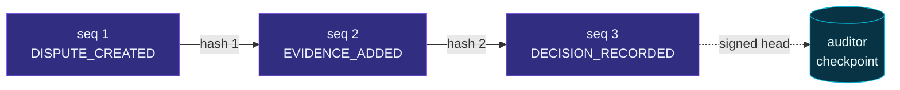
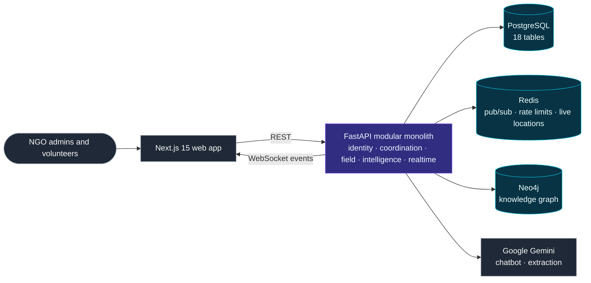
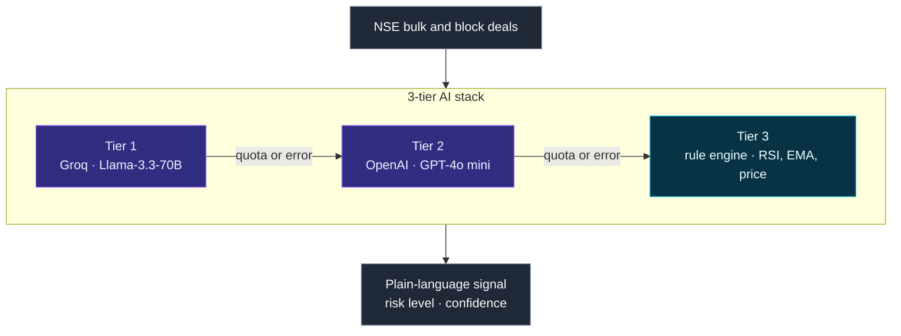
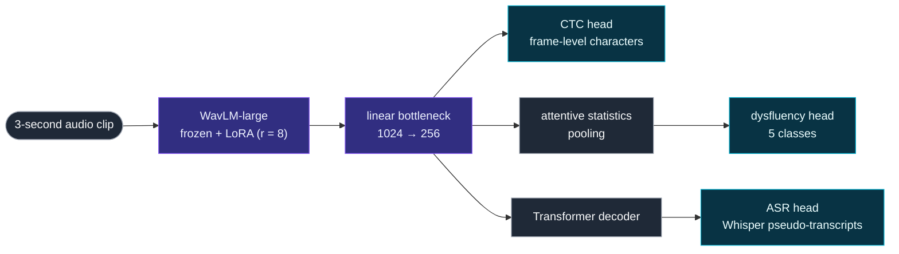

<!-- Profile README for github.com/aishwarysrivastava1 -->

<div align="center">

<picture>
  <source media="(prefers-color-scheme: dark)" srcset="https://capsule-render.vercel.app/api?type=waving&height=230&color=0:0d1117%2C45:3730a3%2C100:0891b2&section=header&text=Aishwary%20Srivastava&fontSize=58&fontColor=ffffff&fontAlignY=36&desc=Backend%20Engineering%20%C2%B7%20Applied%20ML%20%C2%B7%20Data%20Analytics&descSize=18&descAlignY=58&animation=fadeIn" />
  <source media="(prefers-color-scheme: light)" srcset="https://capsule-render.vercel.app/api?type=waving&height=230&color=0:0d1117%2C45:3730a3%2C100:0891b2&section=header&text=Aishwary%20Srivastava&fontSize=58&fontColor=0f172a&fontAlignY=36&desc=Backend%20Engineering%20%C2%B7%20Applied%20ML%20%C2%B7%20Data%20Analytics&descSize=18&descAlignY=58&animation=fadeIn" />
  
</picture>

<a href="#-featured-work"></a>

<a href="https://www.linkedin.com/in/aishwary-s-8b8636274/"></a>
<a href="mailto:aishwarysrivastava1@gmail.com"></a>

<p>


<a href="https://orcid.org/0009-0004-8480-8767"></a>
</p>

<p>
<a href="#-about-me"><kbd>🧭 About</kbd></a>
<a href="#-hiring-start-here"><kbd>🎯 Hiring? Start here</kbd></a>
<a href="#-five-minute-code-tours"><kbd>🔎 Code tours</kbd></a>
<a href="#-featured-work"><kbd>🚀 Featured work</kbd></a>
<a href="#-tech-stack"><kbd>🧰 Tech stack</kbd></a>
<a href="#-how-i-work"><kbd>🧠 How I work</kbd></a>
<a href="#-lets-connect"><kbd>📫 Contact</kbd></a>
</p>

<i>I build software that survives a failing dependency, and I report numbers that hold up when checked.</i>

</div>

<br/>

## 🧭 About me

<a href="https://github.com/aishwarysrivastava1?tab=repositories"></a>

I'm a Computer Science & Engineering undergraduate at **Thapar Institute of Engineering and Technology** (2023–2027). I like owning a problem end to end: the API, the data model, the ML model, and the analysis that says whether any of it worked.

- ⚙️ **Backend:** FastAPI services on PostgreSQL with Redis, WebSockets, JWT / OAuth 2.0, Docker and CI, including state machines, transactional outboxes and signed audit logs.
- 📊 **Data & experimentation:** SQL on BigQuery and DuckDB, retention and survival analysis, churn models validated out of time, and A/B tests checked with bootstrap, permutation and Bayesian methods.
- 🤖 **LLM features that fail gracefully:** model fallback chains, guardrails, allowlisted actions and semantic caching.
- 🧠 **Deep learning:** LoRA fine-tuning of a speech transformer, image-restoration benchmarks, and tabular ML with Optuna and SHAP.

> [!TIP]
> **Open to SDE (backend), ML engineering and data / product analytics roles, for internships and full-time positions.** The role guide below takes you to the right project in one click.

## 🎯 Hiring? Start here

| If you're hiring for… | Start with | What you'll find |
|:--|:--|:--|
| **Backend / SDE** | [ApexResolve](#-apexresolve) · [Sanchaalan Saathi](#-sanchaalan-saathi) | A FastAPI + PostgreSQL 16 dispute engine: 9-state lifecycle, transactional outbox with idempotency keys, double-entry transfers, hash-chained and Ed25519-signed audit ledger · a modular FastAPI monolith: 18-table schema, Redis pub/sub behind WebSockets, rotating JWT refresh tokens · pytest suites and CI on both |
| **ML / AI engineering** | [NMPSD](#-nmpsd) · [ImageDeraining](#-imagederaining) | LoRA on WavLM-large with a four-term multi-task loss · four deraining architectures under one PSNR/SSIM evaluation harness |
| **LLM / GenAI products** | [FinX](#-finx) · [Sanchaalan Saathi](#-sanchaalan-saathi) | Three-tier model fallback (Llama-3.3-70B → GPT-4o mini → rules) · a four-layer chatbot with guardrails, an intent parser, a semantic cache and Gemini streamed over SSE |
| **Data / product analytics** | [Flood-It retention](#-flood-it-retention) · [Cookie Cats A/B test](#-cookie-cats-ab-test) | 5.7M raw GA4 events modelled with 19 BigQuery SQL files, then analysed for retention, survival, churn, segments and anomalies · a 90,189-player A/B test with SRM and power checks, z-tests, bootstrap, permutation and Bayesian analysis · a decision memo for a product team in each |

## 🔎 Five-minute code tours

> [!NOTE]
> Short on time? Open a tour. Each one links straight to the few files that show a skill best.

<details>
<summary><b>⚙️ Backend &amp; systems: state machines, money movement, audit trails</b></summary>

| Open | What to look for |
|:--|:--|
| [`decision.py`](https://github.com/aishwarysrivastava1/apexresolve/blob/main/backend/app/domain/decision.py) <sub>apexresolve</sub> | The whole decision engine: noisy-OR over exact <code>Fraction</code>s and an ordered R1–R7 rule table, with no database, network or clock |
| [`ledger_math.py`](https://github.com/aishwarysrivastava1/apexresolve/blob/main/backend/app/domain/ledger_math.py) <sub>apexresolve</sub> | Canonical JSON, SHA-256 entry hashes, Ed25519 signatures and a verifier that names the first broken link |
| [`0001_initial.sql`](https://github.com/aishwarysrivastava1/apexresolve/blob/main/backend/migrations/0001_initial.sql) <sub>apexresolve</sub> | 19 tables, double-entry ledger lines, an outbox with unique idempotency keys, and triggers that make 6 tables append-only |
| [`worker_jobs.py`](https://github.com/aishwarysrivastava1/apexresolve/blob/main/backend/app/services/worker_jobs.py) <sub>apexresolve</sub> | Timers and transfers as one-transaction jobs claimed with <code>FOR UPDATE SKIP LOCKED</code>, with exponential back-off and a reviewer notified after 10 failed attempts |
| [`ci.yml`](https://github.com/aishwarysrivastava1/apexresolve/blob/main/.github/workflows/ci.yml) <sub>apexresolve</sub> | Five CI jobs: lint, static and dependency security scans, golden vectors, coverage gates, browser tests, secret and container scans |
| [`optimization.py`](https://github.com/aishwarysrivastava1/SanchaalanSaathi/blob/main/services/api/app/domain/optimization.py) <sub>SanchaalanSaathi</sub> | A six-factor cost matrix solved with the Hungarian algorithm up to 900 pairs, and greedily above that |

</details>

<details>
<summary><b>📊 Data &amp; experimentation: SQL, statistics, honest validation</b></summary>

| Open | What to look for |
|:--|:--|
| [`14_create_player_features.sql`](https://github.com/aishwarysrivastava1/flood-it-retention/blob/main/sql/14_create_player_features.sql) <sub>flood-it-retention</sub> | Model features built from joining-day rows only, so nothing from the label window leaks in |
| [`18_verification_checks.sql`](https://github.com/aishwarysrivastava1/flood-it-retention/blob/main/sql/18_verification_checks.sql) <sub>flood-it-retention</sub> | 14 invariants in plain SQL, such as “retention falls as the day number rises” and a direct recount of D7 |
| [`run_views_duckdb.py`](https://github.com/aishwarysrivastava1/flood-it-retention/blob/main/tests/run_views_duckdb.py) <sub>flood-it-retention</sub> | Transpiles the BigQuery SQL to DuckDB with sqlglot and checks it against pandas on simulated events, with no cloud access needed |
| [`05_churn_model.ipynb`](https://github.com/aishwarysrivastava1/flood-it-retention/blob/main/notebooks/05_churn_model.ipynb) <sub>flood-it-retention</sub> | An out-of-time split, an overfit booster caught in the act (train AUC 0.905, test 0.646), calibration and a decile lift table |
| [`pre_analysis_plan.md`](https://github.com/aishwarysrivastava1/CookieCats-A-B-Testing/blob/main/reports/pre_analysis_plan.md) <sub>CookieCats-A-B-Testing</sub> | Hypotheses, metrics, α and decision rules fixed before the analysis |
| [`07_pitfalls_simulations.ipynb`](https://github.com/aishwarysrivastava1/CookieCats-A-B-Testing/blob/main/notebooks/07_pitfalls_simulations.ipynb) <sub>CookieCats-A-B-Testing</sub> | 2,000 simulated A/A tests showing that daily peeking lifts false positives from 5.0% to 21.6% |

</details>

<details>
<summary><b>🧠 Applied ML: parameter-efficient fine-tuning and benchmarks</b></summary>

| Open | What to look for |
|:--|:--|
| [`model.py`](https://github.com/aishwarysrivastava1/NMPSD/blob/main/model.py) <sub>NMPSD</sub> | WavLM-large with LoRA, a 256-d bottleneck, and CTC, pooled-classification and Transformer-decoder heads |
| [`loss.py`](https://github.com/aishwarysrivastava1/NMPSD/blob/main/loss.py) <sub>NMPSD</sub> | One objective: CTC + label-smoothed cross-entropy + asymmetric focal + Gaussian alignment |
| [`quick_test.py`](https://github.com/aishwarysrivastava1/NMPSD/blob/main/quick_test.py) <sub>NMPSD</sub> | Invariant checks that run before any GPU time is spent |
| [`train.py`](https://github.com/aishwarysrivastava1/ImageDeraining/blob/main/Rain%20Location%20Prior/train.py) <sub>ImageDeraining</sub> | Rain Location Prior training with mixed precision and a warm-up, then cosine, learning-rate schedule |

</details>

<details>
<summary><b>🤖 LLM products: fallbacks, guardrails, allowlists</b></summary>

| Open | What to look for |
|:--|:--|
| [`gpt.py`](https://github.com/aishwarysrivastava1/FinX/blob/main/backend/services/gpt.py) <sub>FinX</sub> | Llama-3.3-70B → GPT-4o mini → rule-engine fallback, plus the live context behind grounded chat |
| [`pipeline.py`](https://github.com/aishwarysrivastava1/SanchaalanSaathi/blob/main/services/api/app/domain/chatbot/pipeline.py) <sub>SanchaalanSaathi</sub> | Guardrails → deterministic intent parser → semantic cache (similarity ≥ 0.85) → Gemini, streamed over SSE |
| [`guardrails.py`](https://github.com/aishwarysrivastava1/SanchaalanSaathi/blob/main/services/api/app/domain/chatbot/guardrails.py) <sub>SanchaalanSaathi</sub> | Weighted prompt-injection and harm scores, lowered when humanitarian context such as rescue, flood or medical appears |
| [`responders.py`](https://github.com/aishwarysrivastava1/SanchaalanSaathi/blob/main/services/api/app/domain/chatbot/responders.py) <sub>SanchaalanSaathi</sub> | <code>ALLOWED_CALLS</code>: the allowlist every model-proposed action must match before it runs |

</details>

## 🚀 Featured work


<p align="center"><sub>Services that stay correct under concurrency, retries and audits.</sub></p>

### 🧾 ApexResolve

**Explainable, tamper-evident dispute resolution for a closed-loop card network**

<a href="https://github.com/aishwarysrivastava1/apexresolve"></a>
<a href="https://github.com/aishwarysrivastava1/apexresolve/blob/main/backend/app/domain/decision.py"></a>
<a href="https://github.com/aishwarysrivastava1/apexresolve/blob/main/backend/app/domain/ledger_math.py"></a>
<br/>


A cardmember files a dispute, both sides add evidence, and the system decides, offers a split or hands the case to a person. Then it moves the money exactly once and records every step in a ledger that anyone with the public key can verify. It is an independent student prototype that runs on synthetic data only.

- **Decisions without a black box:** no ML or LLM decides anything. Each evidence item scores its catalogue weight × how it was obtained (system-verified 1.0, document 0.7, self-attested 0.3). The items combine by noisy-OR in exact `Fraction` arithmetic, and an ordered rule table (R1–R7) from a versioned YAML policy decides. **18 golden vectors** cover all seven rules.
- **Money moves exactly once:** a transactional outbox with unique idempotency keys, double-entry transfer lines, and worker jobs claimed with `FOR UPDATE SKIP LOCKED` that back off exponentially and notify a reviewer after 10 failed attempts.
- **Tamper-evident audit trail:** every event carries the SHA-256 hash of the one before it and an **Ed25519 signature**. Triggers make 6 tables append-only, and signed checkpoints that an auditor can download expose truncation. A bundled attack script flips a recorded verdict, and verification reports the exact sequence number that no longer matches.
- **Quality gates:** **92 backend tests** (unit, Hypothesis property, golden, and integration and concurrency tests on a real PostgreSQL 16) plus **6 Playwright browser tests**, with **92% coverage (98% in the pure domain layer)**. CI also runs ruff, bandit, pip-audit, gitleaks and Trivy.

```math
V_{\text{side}} \;=\; 1-\prod_{t}\Bigl(1-\max_{i\,\in\,t}\; w_t\, r_i\Bigr)
\qquad\qquad
\text{margin} \;=\; V_{\text{merchant}}-V_{\text{cardmember}}
```

<p align="center"><sub><i>w</i> is the catalogue weight of an evidence type and <i>r</i> the reliability of how an item was obtained; only the strongest item of each type counts. A margin of +0.40 or more with a compelling merchant item upholds the charge, −0.40 or less refunds it, and otherwise the case becomes a settlement offer or goes to a person.</sub></p>



<p align="center"><sub>An illustrative slice of the ledger. Each entry stores the hash of the one before it, so editing any entry breaks every link after it.</sub></p>

<details>
<summary><b>🔍 Engineering notes</b></summary>

- **Lifecycle as data:** 9 states, 17 events and 18 legal transitions. Any other (state, event) pair returns 409 as an RFC 9457 problem response, and deadlines are rows in a jobs table rather than in-memory timers.
- **Decision table:** amounts above ₹50,000, a non-INR currency or any risk flag always go to a person (a risk flag never auto-denies). Settlement offers cover ₹2–₹10,000 and split the amount by the margin, rounded half-to-even to whole paise, and both parties must accept.
- **Closed-loop fast path:** because the network holds both sides' records, duplicate charges and already-credited charges are decided at filing, with no merchant round-trip.
- **Security and privacy:** JWTs are verified against a cached JWKS that accepts only RS256 and ES256, with issuer and audience checks. Free text is redacted before storage, with Luhn checks for card numbers and Verhoeff checks for Aadhaar numbers.
- **Stack:** 26 API endpoints (24 under `/api/v1` plus 2 health checks), FastAPI with async SQLAlchemy and asyncpg, a 19-table PostgreSQL 16 schema, a React 19 + strict TypeScript web app for four roles, and Docker Compose behind Caddy.

</details>

### 🤝 Sanchaalan Saathi

**AI-assisted volunteer & resource coordination for NGOs**

<a href="https://sanchaalan-saathi.vercel.app/"></a>
<a href="https://github.com/aishwarysrivastava1/SanchaalanSaathi"></a>
<br/>


NGO admins post tasks and resources. The platform matches volunteers to them by skill, distance, availability, workload and reliability, and volunteers accept work, share live location and report completion from the field.

- **Optimal task assignment:** every volunteer–task pair is scored on six weighted factors (distance, skills, availability, urgency, workload, reliability). The cost matrix is solved with the Hungarian algorithm (`scipy.optimize.linear_sum_assignment`) for up to 900 pairs and with a greedy solver above that, and a volunteer with none of the required skills is marked infeasible.
- **Chatbot that tries the cheap layers first:** guardrails, then a deterministic intent parser that answers from a single SQL query, then a semantic cache (similarity ≥ 0.85), and only then Gemini, streamed over SSE. Any action the model proposes must match an allowlist before it runs.
- **Tested and shipped:** **92 pytest tests** run in a GitHub Actions pipeline with API (ruff, pytest, single Alembic head), web (typecheck, Next.js build) and Docker jobs.



<details>
<summary><b>🔍 Engineering notes</b></summary>

- **Modular monolith:** one FastAPI codebase runs as a single process or as separate services (identity, coordination, field, intelligence, realtime), selected by a `SERVICES` environment variable. Routers are imported lazily, so each service loads only what it needs.
- **Data layer:** PostgreSQL is the system of record (18 tables, async SQLAlchemy 2.0, Alembic). Redis carries pub/sub, rate limits and live locations. A multi-tenant Neo4j knowledge graph is built from text, documents and voice recordings that Gemini 2.5 Flash turns into needs, locations and skills.
- **Realtime and auth:** WebSocket events fan out across replicas through Redis pub/sub. Access tokens last 60 minutes; 30-day refresh tokens rotate on use and can be revoked through a Redis denylist.
- **Operations:** separate `/health` and `/ready` probes, and a straight-line (haversine) distance fallback when the routing API is unavailable.

</details>

<p align="right"><sub><a href="#-hiring-start-here">↑ Back to the role guide</a></sub></p>


<p align="center"><sub>Flood-It finds where players leave. Cookie Cats shows how I would test a fix.</sub></p>

### 🌊 Flood-It retention

**Player retention and churn on 5.7M raw GA4 events, from a nested BigQuery export to a decision memo**

<a href="https://github.com/aishwarysrivastava1/flood-it-retention"></a>
<a href="https://github.com/aishwarysrivastava1/flood-it-retention/blob/main/reports/decision_memo.md"></a>
<br/>


- **From raw events to answers:** 5,700,000 nested GA4 events from 15,175 device-level players over 114 days, modelled in **19 SQL files** (profiling, staging, player-day and session facts, daily KPIs, retention and cohorts, model features, funnels) and guarded by **14 invariant checks**.
- **The first day decides:** D1 retention is **13.33%**, D7 **5.04%** and D30 **2.61%**, and the Kaplan-Meier median time to churn is **1 day**. 66.9% of new players start a level on day 0, but only **42.6%** of those finish one, so the memo recommends an A/B test of an easier first-level experience.
- **A churn model that is honest about its limits:** trained on earlier cohorts and tested on later ones, it reaches **ROC-AUC 0.677** and **PR-AUC 0.854** against a 0.758 base rate. The riskiest decile churns only **1.17×** the average, so a broad onboarding fix beats targeted rescue offers.

<p align="center">


<br/><sub>Left: almost all of the loss happens on day 1. Right: players who got further on their first day stay longer (Kaplan-Meier; descriptive, not causal).</sub>
</p>

<details>
<summary><b>🔍 Engineering notes</b></summary>

- **Segmentation:** K-means on day-0 behaviour (K = 5, silhouette 0.419) with retention kept out of the inputs, stable across seeds (ARI 0.994). “Quick bouncers” are 59.8% of new players and return within 7 days at 21.6%, against 55.2% for power players.
- **Anomalies:** STL decomposition plus a robust z-score flags 8 of 100 days. On 7 of them, DAU drops while per-player behaviour stays normal, so they are reported as probable event loss for data engineering rather than as a change in behaviour.
- **Forecasting:** on a 14-day backtest a seasonal naive forecast (MAPE 7.70%) beats damped ETS (11.59%), so the baseline is what the memo recommends.
- **Survival and tests:** Kaplan-Meier curves and a Cox model (concordance 0.594), with the failed proportional-hazards checks reported. Day-0 features are compared with Holm-corrected Mann-Whitney tests and rank-biserial effect sizes, and rewarded ads come out statistically significant but practically irrelevant (effect size 0.006).
- **Offline test harness:** the BigQuery SQL is transpiled to DuckDB with sqlglot and run on simulated events with a planted outage. Its latest run passed **15 of 15 checks**, including all 14 invariants, and matched an independent pandas implementation.

</details>

### 🍪 Cookie Cats A/B test

**Should a mobile game move its first progression gate from level 30 to level 40?**

<a href="https://github.com/aishwarysrivastava1/CookieCats-A-B-Testing"></a>
<a href="https://github.com/aishwarysrivastava1/CookieCats-A-B-Testing/blob/main/reports/decision_memo.md"></a>
<a href="https://github.com/aishwarysrivastava1/CookieCats-A-B-Testing/blob/main/reports/pre_analysis_plan.md"></a>
<br/>


- **Recommendation: keep the gate at level 30.** Across **90,189** randomly assigned players, D7 retention fell from 19.02% to 18.20%, a change of **−0.82 pp** (95% CI −1.33 to −0.31 pp, p = 0.0016, Holm-adjusted p = 0.0031). That is about 82 fewer day-7 returners per 10,000 installs.
- **Three robustness checks agree:** bootstrap (10,000 resamples), a permutation test (2,000,000 hypergeometric draws) and a Bayesian Beta-Binomial model that puts the probability that gate 40 is better at about 0.1%.
- **Pitfalls simulated, not asserted:** across 2,000 simulated A/A tests, checking daily for 14 days raises the false-positive rate from 5.0% to 21.6%, and a calibrated boundary of |z| = 2.632 brings it back to about 5%. Filtering on rounds played, a post-treatment variable, more than doubles the apparent effect.

<p align="center">


<br/><sub>Left: the observed D7 drop sits in the far tail of what shuffling the group labels produces. Right: the Bayesian posteriors barely overlap.</sub>
</p>

<details>
<summary><b>🔍 Engineering notes</b></summary>

- **Validity and power first:** a sample-ratio-mismatch check (borderline, reported rather than ignored) and a power analysis showing the test could detect D7 changes of about 0.73 pp; detecting 0.5 pp would need about 95,700 players per group.
- **Deliverables:** 8 SQL files on DuckDB (CTEs, window functions, joins), 7 notebooks, 11 charts, a pre-analysis plan, a decision memo, and a Streamlit A/B analyzer with a sample-size planner.

</details>

<p align="right"><sub><a href="#-hiring-start-here">↑ Back to the role guide</a></sub></p>


<p align="center"><sub>Parameter-efficient fine-tuning, reproducible benchmarks, and LLM features that degrade gracefully.</sub></p>

### 📈 FinX

**Real-time NSE market intelligence that explains institutional deals in plain language**

<a href="https://finx-pi.vercel.app/"></a>
<a href="https://github.com/aishwarysrivastava1/FinX"></a>
<br/>


- **AI layer that degrades gracefully:** NSE bulk and block deals are explained by Groq **Llama-3.3-70B**, which falls back to **GPT-4o mini** on quota or error and then to a rule-based engine (RSI, EMA, price), so the radar keeps producing signals when an LLM API fails.
- **Real-time pipeline:** APScheduler refreshes live quotes every 2 s and market movers every 3 s, and re-runs the deal radar every hour. A per-symbol WebSocket streams prices, and signal cards show the price first while the AI analysis loads.
- **Grounded market chat:** every question is sent with live context (Nifty 50 snapshot, recent radar signals with their technicals, recently viewed stocks and market headlines), so answers come from today's data.



<details>
<summary><b>🔍 Engineering notes</b></summary>

- **Signal backtests:** RSI < 30 and EMA-20/50 crossover signals are backtested on 2 years of daily prices to report each stock's 5-day forward win rate.
- **Auth and security:** email verification, Google OAuth 2.0, JWT access tokens with rotating refresh tokens, bcrypt (12 rounds), per-IP login rate limiting (10 attempts per 60 s) and 5 security headers, covered by **22 pytest tests**.

</details>

### 🎤 NMPSD

**Multi-task stuttering-event detection with a LoRA-adapted WavLM-large encoder**

<a href="https://github.com/aishwarysrivastava1/NMPSD"></a>
<br/>


- **Task:** multi-label detection of five dysfluency types (prolongation, block, sound repetition, word repetition, interjection) in 3-second clips from SEP-28k (28,177 clips).
- **Parameter-efficient fine-tuning:** LoRA (r = 8) on a frozen `microsoft/wavlm-large`, so **3.49M of 318.9M parameters are trainable (1.09%)**. The setup is sized for an 8 GB GPU and enforces a 7.5 GB memory guard.
- **Multi-task design:** attentive statistics pooling (mean ‖ std) feeds the classifier, while CTC and Transformer-decoder ASR heads trained on Whisper pseudo-transcripts keep frame-level timing in the encoder. One objective combines CTC, label-smoothed cross-entropy, asymmetric focal and Gaussian alignment losses.



<details>
<summary><b>🔍 Engineering notes</b></summary>

- **Reliable pipeline:** Silero VAD cleans the Whisper teacher's input and transcripts are cached once. `quick_test.py` asserts the pipeline's invariants before training, checkpoints resume model, EMA, optimizer, scheduler and scaler state, and each stage runs as a child process so GPU memory is freed between stages.

</details>

### ☔ ImageDeraining

**Four state-of-the-art single-image deraining architectures under one evaluation harness**

<a href="https://github.com/aishwarysrivastava1/ImageDeraining"></a>
<br/>


| Architecture | Core idea | In this repo |
|:--|:--|:--|
| **Rain Location Prior** | Predicts where the rain is and injects that map into a Uformer backbone as a prior | Charbonnier loss, mixed precision, warm-up then cosine schedule |
| **MFDNet** | Decomposes features across scales to separate rain layers from background structure | Charbonnier + edge + SSIM losses |
| **NeRD** | Implicit neural representations with multi-scale transformers, aimed at raindrops | Charbonnier + FFT + edge + L1 losses |
| **NDR** | Non-local operations that exploit how self-similar rain streaks are across an image | Inference scripts that free GPU memory after every image |

- **Unified evaluation:** PSNR/SSIM scoring across GTAV-NightRain, GT-Rain, RainDS, Outdoor-Rain, RealRain-1k and SynRain-13k, with per-image results committed as CSVs (MFDNet and NDR on 10 test sets, RLP on 9).
- **Credited sources:** each model is adapted from its upstream codebase, which the repo credits.

### 🧪 More ML projects

<table>
<tr>
<td width="33%" valign="top">
<b>🩺 Diabetes Risk Prediction</b><br/><br/>
Logistic Regression, an RBF SVM and a Keras neural network compared on 100,000 patient records. The network reached <b>0.976 ROC-AUC</b> (Logistic Regression: 0.962).<br/><br/>
<a href="https://github.com/aishwarysrivastava1/Projects/tree/main/DiabetesPrediction">View notebook →</a>
</td>
<td width="33%" valign="top">
<b>🔬 LiverGuard</b><br/><br/>
ML for an AI-IoT liver-health screening prototype: skin-colour RGB, infrared temperature, GSR and BMI inputs, a CIE-XYZ yellowness-index feature, six Optuna-tuned models, stacking and soft-voting ensembles, SHAP, and a Streamlit app that scores raw sensor readings.<br/><br/>
<a href="https://github.com/aishwarysrivastava1/Projects/tree/main/LiverGuard">View project →</a>
</td>
<td width="33%" valign="top">
<b>🍱 NutriVision</b><br/><br/>
Nutrient estimation on Nutrition5k: a CNN over 7-channel RGB + depth images, fused with a tabular MLP, predicts calories, mass, protein, fat and carbs.<br/><br/>
<a href="https://github.com/aishwarysrivastava1/Projects/tree/main/NutriVision">View notebook →</a>
</td>
</tr>
</table>

<p align="right"><sub><a href="#-hiring-start-here">↑ Back to the role guide</a></sub></p>

## 🧰 Tech stack

<p align="center">

</p>

<table>
<tr>
<td><b>Languages</b></td>
<td>


</td>
</tr>
<tr>
<td><b>Backend &amp; APIs</b></td>
<td>


</td>
</tr>
<tr>
<td><b>Databases &amp; warehouses</b></td>
<td>


</td>
</tr>
<tr>
<td><b>Testing &amp; quality</b></td>
<td>


</td>
</tr>
<tr>
<td><b>ML &amp; deep learning</b></td>
<td>


</td>
</tr>
<tr>
<td><b>LLM APIs</b></td>
<td>


</td>
</tr>
<tr>
<td><b>Data &amp; statistics</b></td>
<td>


</td>
</tr>
<tr>
<td><b>DevOps &amp; cloud</b></td>
<td>


</td>
</tr>
<tr>
<td><b>Frontend<br/><sub>used in projects</sub></b></td>
<td>


</td>
</tr>
</table>

## 🧠 How I work

| Principle | Where you can see it |
|:--|:--|
| **Test what can break** | 92 backend + 6 browser tests behind coverage gates of 80% overall and 95% for the domain layer ([ApexResolve](https://github.com/aishwarysrivastava1/apexresolve)) · 92 pytest tests and a 3-job CI pipeline ([Sanchaalan Saathi](https://github.com/aishwarysrivastava1/SanchaalanSaathi)) · a 15-check offline harness that runs the warehouse SQL without the cloud ([Flood-It](https://github.com/aishwarysrivastava1/flood-it-retention)) · invariant smoke tests before training ([NMPSD](https://github.com/aishwarysrivastava1/NMPSD)) |
| **Design for failure** | Retries with exponential back-off that notify a reviewer after 10 attempts ([ApexResolve](https://github.com/aishwarysrivastava1/apexresolve)) · LLM → LLM → rules fallback ([FinX](https://github.com/aishwarysrivastava1/FinX)) · separate liveness and readiness probes, and a straight-line-distance fallback when the routing API is missing ([Sanchaalan Saathi](https://github.com/aishwarysrivastava1/SanchaalanSaathi)) · a GPU memory guard ([NMPSD](https://github.com/aishwarysrivastava1/NMPSD)) |
| **Make it verifiable** | A hash-chained, signed ledger with a tamper demo, and 18 golden vectors that cover all seven decision rules ([ApexResolve](https://github.com/aishwarysrivastava1/apexresolve)) · every number in the decision memo traces back to a notebook run on the SQL views ([Flood-It](https://github.com/aishwarysrivastava1/flood-it-retention)) |
| **Decide before you look** | Hypotheses, metrics, α and decision rules in a pre-analysis plan ([Cookie Cats](https://github.com/aishwarysrivastava1/CookieCats-A-B-Testing)) · out-of-time validation, and a threshold chosen on out-of-fold training predictions, never on the test set ([Flood-It](https://github.com/aishwarysrivastava1/flood-it-retention)) |
| **Report the caveats** | A borderline sample-ratio mismatch and an impossible 49,854-round outlier flagged in the open ([Cookie Cats](https://github.com/aishwarysrivastava1/CookieCats-A-B-Testing)) · seven low-traffic days reported as probable tracking loss, and a naive forecast recommended because it beat the fancier model ([Flood-It](https://github.com/aishwarysrivastava1/flood-it-retention)) |

## 🏅 Certifications

<p align="center">
<a href="https://drive.google.com/file/d/1XBDhq5uGgdhVOB5ldND2z9q91CsQTNHs/view?usp=sharing"></a>
<a href="https://drive.google.com/file/d/1Ub6iWo8q4h4zlvOLx8JMY1ag-6kiG48U/view?usp=sharing"></a>
<a href="https://drive.google.com/file/d/12SNcy1MTIO-DoAOin0ypCaz86PRO5YNk/view?usp=sharing"></a>
</p>

<div align="center">

## 📫 Let's connect

Hiring for backend, ML or data roles, or curious about one of these projects? I'd be glad to talk.

<a href="https://www.linkedin.com/in/aishwary-s-8b8636274/"></a>
<a href="mailto:aishwarysrivastava1@gmail.com"></a>

<br/>


</div>
