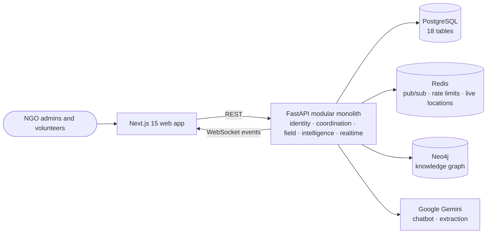
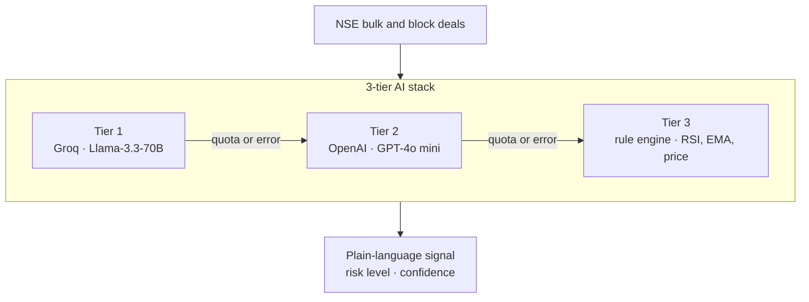

<!-- Profile README for github.com/aishwarysrivastava1 -->

<picture>
  <source media="(prefers-color-scheme: dark)" srcset="https://capsule-render.vercel.app/api?type=waving&height=230&color=0:0d1117%2C45:3730a3%2C100:0891b2&section=header&text=Aishwary%20Srivastava&fontSize=58&fontColor=ffffff&fontAlignY=36&desc=Backend%20Engineering%20%C2%B7%20Applied%20ML%20%C2%B7%20Data%20Analytics&descSize=18&descAlignY=58&animation=fadeIn" />
  <source media="(prefers-color-scheme: light)" srcset="https://capsule-render.vercel.app/api?type=waving&height=230&color=0:0d1117%2C45:3730a3%2C100:0891b2&section=header&text=Aishwary%20Srivastava&fontSize=58&fontColor=0f172a&fontAlignY=36&desc=Backend%20Engineering%20%C2%B7%20Applied%20ML%20%C2%B7%20Data%20Analytics&descSize=18&descAlignY=58&animation=fadeIn" />
  
</picture>

<a href="#-about-me">About</a> &nbsp;·&nbsp;
<a href="#-hiring-start-here">Hiring? Start here</a> &nbsp;·&nbsp;
<a href="#-featured-work">Featured work</a> &nbsp;·&nbsp;
<a href="#-tech-stack">Tech stack</a> &nbsp;·&nbsp;
<a href="#-how-i-work">How I work</a> &nbsp;·&nbsp;
<a href="#-lets-connect">Contact</a>

<i>I build software that survives a failing dependency, and I report numbers that hold up when checked.</i>

 

## 🧭 About me

I'm a Computer Science & Engineering undergraduate at **Thapar Institute of Engineering and Technology** (2023–2027). I like owning a problem end to end: the API, the data model, the ML model, and the analysis that says whether any of it worked.

- ⚙️ **Backend:** FastAPI services with PostgreSQL, Redis, WebSockets, JWT / OAuth 2.0, Docker and CI.
- 🤖 **LLM features that fail gracefully:** model fallback chains, guardrails, allowlisted actions and semantic caching.
- 🧠 **Deep learning:** LoRA fine-tuning of a speech transformer, image-restoration benchmarks, and tabular ML with Optuna and SHAP.
- 📊 **Data & experimentation:** SQL, power analysis, hypothesis tests, and bootstrap, permutation and Bayesian checks.
- 🎯 **Open to** SDE (Backend), ML Engineering and Data / Product Analytics roles, for internships and full-time positions.

## 🎯 Hiring? Start here

| If you're hiring for… | Look at | What you'll find |
|:--|:--|:--|
| **Backend / SDE** | [Sanchaalan Saathi](https://github.com/aishwarysrivastava1/SanchaalanSaathi) · [FinX](https://github.com/aishwarysrivastava1/FinX) | FastAPI modular monolith · 18-table PostgreSQL schema with Alembic migrations · Redis pub/sub behind WebSockets · JWT refresh-token rotation · rate limiting · pytest suites (92 and 22 tests) · GitHub Actions CI · Docker |
| **ML / AI engineering** | [NMPSD](https://github.com/aishwarysrivastava1/NMPSD) · [ImageDeraining](https://github.com/aishwarysrivastava1/ImageDeraining) | LoRA on WavLM-large with a four-term multi-task loss · four state-of-the-art deraining architectures under one PSNR/SSIM evaluation harness |
| **LLM / GenAI products** | [FinX](https://github.com/aishwarysrivastava1/FinX) · [Sanchaalan Saathi](https://github.com/aishwarysrivastava1/SanchaalanSaathi) | Three-tier model fallback (Llama-3.3-70B → GPT-4o mini → rules) · four-layer chatbot with guardrails, an intent parser, a semantic cache and Gemini streamed over SSE |
| **Data / product analytics** | [Cookie Cats A/B test](https://github.com/aishwarysrivastava1/CookieCats-A-B-Testing) | 8 SQL files on DuckDB · SRM and power checks · z-tests, bootstrap, permutation and Bayesian analysis · a decision memo written for a product team |

## 🚀 Featured work

### 🤝 Sanchaalan Saathi

**AI-assisted volunteer & resource coordination for NGOs**

 

NGO admins post tasks and resources. The platform matches volunteers to them by skill, distance, availability, workload and reliability, and volunteers accept work, share live location and report completion from the field.

- **Optimal task assignment:** every volunteer–task pair is scored on six weighted factors (distance, skills, availability, urgency, workload, reliability). The cost matrix is solved with the Hungarian algorithm (`scipy.optimize.linear_sum_assignment`) for up to 900 pairs and with a greedy solver above that, and a volunteer with none of the required skills is marked infeasible.
- **Modular monolith:** one FastAPI codebase runs as a single process or as separate services (identity, coordination, field, intelligence, realtime), selected by a `SERVICES` environment variable. Routers are imported lazily, so each service loads only what it needs.
- **Data layer:** PostgreSQL is the system of record (18 tables, async SQLAlchemy 2.0, Alembic). Redis carries pub/sub, rate limits and live locations. A multi-tenant Neo4j knowledge graph is built from text, documents and voice recordings that Gemini 2.5 Flash turns into needs, locations and skills.
- **Chatbot that tries the cheap layers first:** guardrails, then a deterministic intent parser that answers from a single SQL query, then a semantic cache (similarity ≥ 0.85), and only then Gemini, streamed over SSE. Any action the model proposes must match an allowlist before it runs.
- **Realtime, auth and quality:** WebSocket events fan out across replicas through Redis pub/sub. Access tokens last 60 minutes; 30-day refresh tokens rotate on use and can be revoked through a Redis denylist. **92 pytest tests** run in a GitHub Actions pipeline with API (ruff, pytest, single Alembic head), web (typecheck, Next.js build) and Docker jobs.

### 📈 FinX

**Real-time NSE market intelligence that explains institutional deals in plain language**

 

- **AI layer that degrades gracefully:** NSE bulk and block deals are explained by Groq **Llama-3.3-70B**, which falls back to **GPT-4o mini** on quota or error and then to a rule-based engine (RSI, EMA, price), so the radar keeps producing signals when an LLM API fails.
- **Real-time pipeline:** APScheduler refreshes live quotes every 2 s and market movers every 3 s, and re-runs the deal radar every hour. A per-symbol WebSocket streams prices, and signal cards show the price first while the AI analysis loads.
- **Grounded market chat:** every question is sent with live context (Nifty 50 snapshot, recent radar signals with their technicals, recently viewed stocks and market headlines), so answers come from today's data.
- **Signal backtests:** RSI < 30 and EMA-20/50 crossover signals are backtested on 2 years of daily prices to report each stock's 5-day forward win rate.
- **Auth and security:** email verification, Google OAuth 2.0, JWT access tokens with rotating refresh tokens, bcrypt (12 rounds), per-IP login rate limiting (10 attempts per 60 s) and 5 security headers, covered by **22 pytest tests**.

### 🍪 Cookie Cats A/B test

**Should a mobile game move its first progression gate from level 30 to level 40?**

 

- **Recommendation: keep the gate at level 30.** Across **90,189** randomly assigned players, D7 retention fell from 19.02% to 18.20%, a change of **−0.82 pp** (95% CI −1.33 to −0.31 pp, p = 0.0016, Holm-adjusted p = 0.0031). That is about 82 fewer day-7 returners per 10,000 installs.
- **Three robustness checks agree:** bootstrap (10,000 resamples), a permutation test (2,000,000 hypergeometric draws) and a Bayesian Beta-Binomial model that puts the probability that gate 40 is better at about 0.1%.
- **Validity and power first:** a sample-ratio-mismatch check (borderline, reported rather than ignored) and a power analysis showing the test could detect D7 changes of about 0.73 pp; detecting 0.5 pp would need about 95,700 players per group.
- **Pitfalls simulated, not asserted:** across 2,000 simulated A/A tests, checking daily for 14 days raises the false-positive rate from 5.0% to 21.6%, and a calibrated boundary of |z| = 2.632 brings it back to about 5%. Filtering on rounds played, a post-treatment variable, more than doubles the apparent effect.
- **Deliverables:** 8 SQL files on DuckDB (CTEs, window functions, joins), 7 notebooks, 11 charts, a pre-analysis plan, a decision memo, and a Streamlit A/B analyzer with a sample-size planner.

 Retention difference, gate 40 minus gate 30, with 95% confidence intervals. The D7 interval lies entirely below zero.

### 🎙️ NMPSD

**Multi-task stuttering-event detection with a LoRA-adapted WavLM-large encoder**

 

- **Task:** multi-label detection of five dysfluency types (prolongation, block, sound repetition, word repetition, interjection) in 3-second clips from SEP-28k (28,177 clips).
- **Parameter-efficient fine-tuning:** LoRA (r = 8) on a frozen `microsoft/wavlm-large`, so **3.49 M of 318.9 M parameters are trainable (1.09 %)**. The setup is sized for an 8 GB GPU and enforces a 7.5 GB memory guard.
- **Multi-task design:** attentive statistics pooling (mean ‖ std) feeds the classifier, while CTC and Transformer-decoder ASR heads trained on Whisper pseudo-transcripts keep frame-level timing in the encoder. One objective combines CTC, label-smoothed cross-entropy, asymmetric focal and Gaussian alignment losses.
- **Reliable pipeline:** Silero VAD cleans the Whisper teacher's input and transcripts are cached once. `quick_test.py` asserts the pipeline's invariants before training, checkpoints resume model, EMA, optimizer, scheduler and scaler state, and each stage runs as a child process so GPU memory is freed between stages.

### 🌧️ ImageDeraining

**Four state-of-the-art single-image deraining architectures under one evaluation harness**

 

- **Architectures:** Rain Location Prior (with its prior-injection module on a Uformer backbone), MFDNet, NeRD and NDR, adapted from their upstream codebases, which the repo credits.
- **Unified evaluation:** PSNR/SSIM scoring across GTAV-NightRain, GT-Rain, RainDS, Outdoor-Rain, RealRain-1k and SynRain-13k, with per-image results committed as CSVs (MFDNet and NDR on 10 test sets, RLP on 9).
- **Training and inference upgrades:** mixed-precision training, Charbonnier, edge, SSIM and FFT losses, warm-up plus cosine learning-rate schedules, and inference loops that free GPU memory after every image so large test sets fit on consumer GPUs.

### 🧪 More ML projects

<table>
<tr>
<td width="33%" valign="top">
<b>🩺 Diabetes Risk Prediction</b>  
Logistic Regression, an RBF SVM and a Keras neural network compared on 100,000 patient records. The network reached <b>0.976 ROC-AUC</b> (Logistic Regression: 0.962).  
<a href="https://github.com/aishwarysrivastava1/Projects/tree/main/DiabetesPrediction">View notebook →</a>
</td>
<td width="33%" valign="top">
<b>🔬 LiverGuard</b>  
ML for an AI-IoT liver-health screening prototype: skin-colour RGB, infrared temperature, GSR and BMI inputs, a CIE-XYZ yellowness-index feature, six Optuna-tuned models, stacking and soft-voting ensembles, SHAP, and a Streamlit app that scores raw sensor readings.  
<a href="https://github.com/aishwarysrivastava1/Projects/tree/main/LiverGuard">View project →</a>
</td>
<td width="33%" valign="top">
<b>🍱 NutriVision</b>  
Nutrient estimation on Nutrition5k: a CNN over 7-channel RGB + depth images, fused with a tabular MLP, predicts calories, mass, protein, fat and carbs.  
<a href="https://github.com/aishwarysrivastava1/Projects/tree/main/NutriVision">View notebook →</a>
</td>
</tr>
</table>

## 🧰 Tech stack

<table>
<tr>
<td><b>Languages</b></td>
<td>

</td>
</tr>
<tr>
<td><b>Backend &amp; APIs</b></td>
<td>

</td>
</tr>
<tr>
<td><b>Databases &amp; caching</b></td>
<td>

</td>
</tr>
<tr>
<td><b>ML &amp; deep learning</b></td>
<td>

</td>
</tr>
<tr>
<td><b>LLM APIs</b></td>
<td>

</td>
</tr>
<tr>
<td><b>Data &amp; statistics</b></td>
<td>

</td>
</tr>
<tr>
<td><b>DevOps &amp; cloud</b></td>
<td>

</td>
</tr>
<tr>
<td><b>Frontend used in projects</b></td>
<td>

</td>
</tr>
</table>

## 🧠 How I work

| Principle | Where you can see it |
|:--|:--|
| **Test what can break** | 92 pytest tests and a 3-job CI pipeline ([Sanchaalan Saathi](https://github.com/aishwarysrivastava1/SanchaalanSaathi)) · 22 auth and security tests ([FinX](https://github.com/aishwarysrivastava1/FinX)) · invariant smoke tests to run before training ([NMPSD](https://github.com/aishwarysrivastava1/NMPSD)) |
| **Design for failure** | LLM → LLM → rules fallback ([FinX](https://github.com/aishwarysrivastava1/FinX)) · separate liveness and readiness probes, and a straight-line-distance fallback when the routing API is missing ([Sanchaalan Saathi](https://github.com/aishwarysrivastava1/SanchaalanSaathi)) · a GPU memory guard ([NMPSD](https://github.com/aishwarysrivastava1/NMPSD)) |
| **Decide before you look** | Hypotheses, metrics, α, a practical-significance threshold and decision rules written into a pre-analysis plan ([Cookie Cats](https://github.com/aishwarysrivastava1/CookieCats-A-B-Testing)) |
| **Report the caveats** | A borderline sample-ratio mismatch and an impossible 49,854-round outlier are flagged in the open instead of being quietly dropped ([Cookie Cats](https://github.com/aishwarysrivastava1/CookieCats-A-B-Testing)) |

## 🏅 Certifications

## 📫 Let's connect

Hiring for backend, ML or data roles, or curious about one of these projects? I'd be glad to talk.

 

